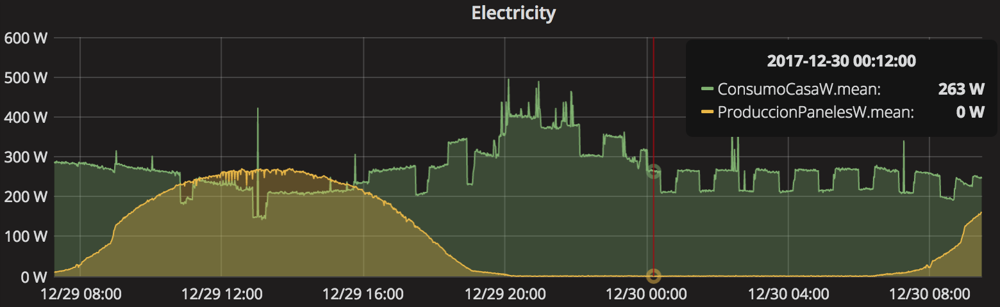
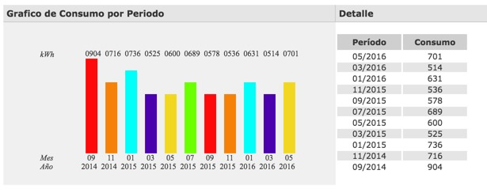
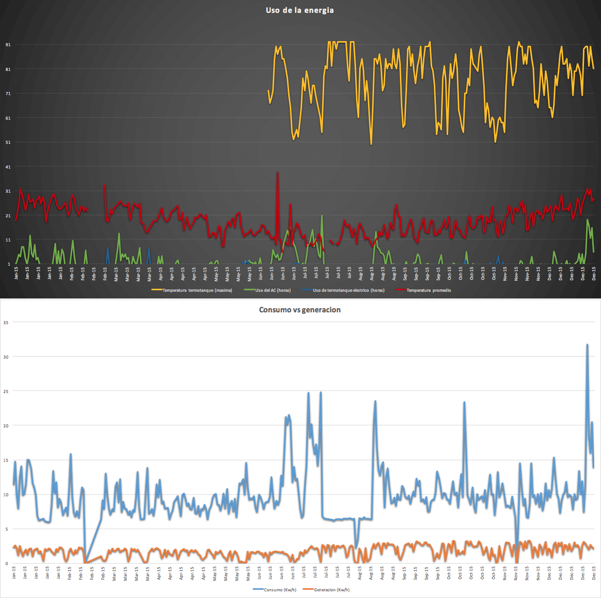

Las necesidades energéticas de una casa están fuertemente determinadas por el uso de energía para climatización, iluminación y electrodomésticos. En [en la sección de diseño](Diseno y construccion.md) se explica cómo un diseño pasivo ayuda a disminuir el uso de energía para climatizar. Similarmente [en la sección confort](Confort.md#Temperatura_agradable) mostramos el uso de aire acondicionados de alta eficiencia. En esta sección no enfocamos en otros aspectos que hacen a la eficiencia energética.

## Iluminación
Se utilizaron tres estrategias para lograr una iluminación de calidad y alta eficiencia. 

1. El diseño de la casa y las aberturas siguen el principio de [daylighting](http://en.wikipedia.org/wiki/Daylighting) para utilizar la luz natural lo mas posible. En particular se introdujeron quiebres en la loza para poder genera entradas de luz en lugares oscuros. También se usaron tubos solares para resolver situaciones donde no había ventanas o oportunidades de generar aberturas cenitales.
1. Se utilizaron lamparas de LED y se priorizo la cantidad y no la potencia individual para lograr una iluminación uniforme. Por ejemplo la fachada de la casa usa 30 lamparas dicroicas (GU10) y pero consume solo 100W (o sea un promedio de 3W por lampara). Todas las lamparas están colocadas en artefactos que poseen reflector y difusor. Esto busca suavizar la luz y mejorar la estética. También en el caso de las lamparas de LED contribuye a la difusión del calor lo cual mejora la vida útil de las mismas.
1. Otro aspecto clave para el ahorro energético es el manejo automático de la iluminación. En particular se implementaron los siguientes automatismos:
  * Las luces exteriores se prenden al bajar el sol y se apagan a las 12pm. También se prenden automáticamente en caso que se detecte la entrada de vehículos o peatones.
  * La iluminación exterior esta sectorizada en un grupo de lamparas de uso diario (pocas lamparas) y otro grupo "de fiesta" donde se encienden luces cuya función es vestir las paredes.  
  * En las areas de paso como pasillos y escaleras, las luces se prenden solas utilizando los sensores de presencia
  * En la zona de los dormitorios se encuentran algunas luces de noche que quedan prendidas toda la noche. Las mismas bajan su intensidad luego de las 22hs y se apagan solas al amanecer.

## Paneles solares foto voltaicos

La casa cuenta con paneles solares para generar el 20% del consumo diario. En total tenemos 5 paneles de 120W lo cual da una generación teórica instantánea de 600W/h. En la practica logramos una generación de 444W/h luego de restar todas las ineficiencias de transmisión y conversión (o sea un 73% de eficiencia). 
El sistema es grid-tie y por ende el exceso de energía generado se devuelve a la red eléctrica. En Cordoba no hay net metering y por lo tanto la compañía eléctrica no contabiliza el excedente. Esta es la razón por la cual el sistema se dimensiono para generar solo el 20% del consumo total. 

En el siguiente gráfico se muestra un dia de consumo moderado (solo iluminación y domotica). La curva verde muestra consumo y la marrón generación.

Se puede observar varias cosas:

* El horario de generación fue entre las 7hs y 19hs (en diciembre) y entre las 10hs y 16hs la producción se mantuvo arriba de 200W/h
* La generación pico fue de 270W/h
* Alrededor del medio día hubo energía generada que no fue consumida y se inyecto en la red eléctrica. En un día normal, programaríamos el lavavajillas o el lavarropa para que se prenda automáticamente al medio día (esta practica se conoce como ["Load Shifting"](https://en.wikipedia.org/wiki/Load_management)
* El consumo base de la casa es de 220W/h. Esto se debe principalmente a la domotica y redes de computación

En resumen, La CasaC consume 200W/h de base y los paneles pueden llegar a generar 400W/h. De esta forma podemos cubrir el consumo mínimo y generar un pequeño excedente el cual usamos programando el uso de electrodomésticos como el lavarropa para las horas de generación pico.
<!--  -->

## Termo-tanque solar
El mecanismo principal para tener agua caliente es un termotanque solar Hissuma. El mismo esta sobre dimensionado para una familia de 4 personas (300 litros). Gracias a esto podemos tener agua caliente incluso luego de dos días nublados (debido a la alta acumulación). En el 2015 el termotanque pudo servir agua caliente el 92% de los dias del año. Para lograr estos niveles de eficiencia, detrás del termotanque hay un sofisticado sistema de control el cual se integra con la automatización de la casa. La estrategia de control busca que a las 6pm el tanque tenga al menos el 150 litros de agua a 52C. Para lograr esto el controlador va llenando el tanque lentamente y viendo como el agua se calienta por el sol. Dependiendo de la velocidad de calentamiento, el controlador puede decidir activar una resistencia eléctrica para suplementar al sol y asi lograr la meta diaria. En el 2015 el uso de energía eléctrica se limito a solo 28 dias (45 horas).

Es importante notar que la vajilla se lava principalmente en un lavavajilla y por ende no hace falta agua caliente en la cocina. Esto hace que el uso del termotanque se principalmente para ducharse (4 personas todos los días). Gracias a esto el sistema de control solo tiene que garantizar agua caliente luego de las 6pm y no durante todo el dia.

Recientemente incorporamos un calefon a gas para poder contar con agua caliente ilimitada fuera de la rutina programada (por ejemplo eventos sociales o duchas por la mañana en invierno).

Para mas información sobre la instalación de agua caliente ver el [esquema detallado](../../uploads/Conexion%20termotanque%20-%20161002.pdf).

## Electrodomésticos
Una parte clave de la eficiencia energética es la disminución del consumo. Gracias al monitoreo del uso eléctrico, progresivamente fuimos reemplazando artefactos de alto consumo por otros de menor consumo (clase A). En particular el reemplazo de la heladera fue uno de los mas significativos. Similarmente reemplazamos todas las fuentes externas que usaban transformador por fuentes conmutadas. Hoy la casa requiere entre 100-200W para mantener todos los aparatos en standby. La mayoría de este consumo viene de la infraestructura para Internet y el sistema de control.

## Eficiencia energética medida en 2015
A continuación presentamos los resultados del uso de energía eléctrica durante el año 2015:

* El aire acondicionado se uso para calefaccionar o refrigerar la casa en 185 dias y por un total de 694 horas
* La resistencia del termotanque solar se prendió por 45 horas (solo hizo falta en 28 dias). El resto de los dias el sol fue suficiente para proveernos de agua caliente
* Los paneles solares generaron el 18% de la energía consumida
* El consumo total de energia fue 10.0 Kw/m2/año. O sea una calificación energética A

<!--  -->

