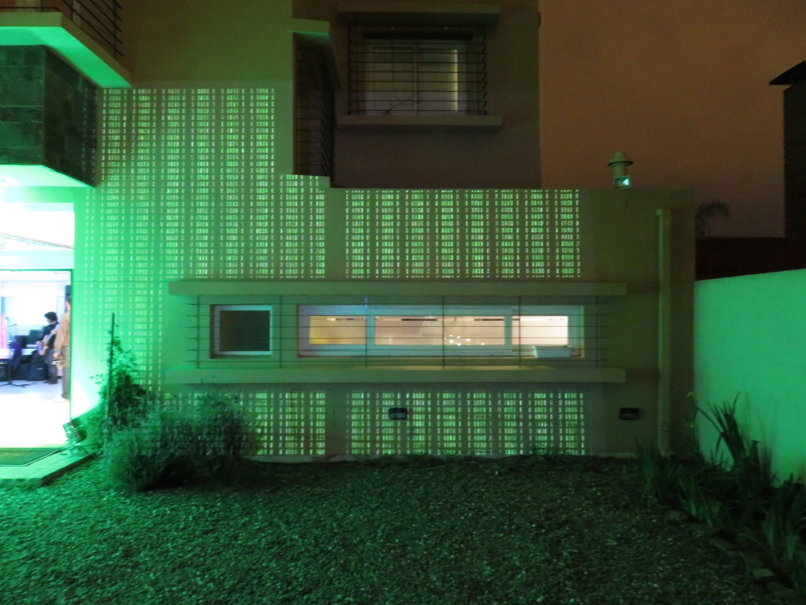

La CasaC es un casa diseñada con los siguientes principios:

* [Confort](construccion/Confort.md)
* [Eficiencia energética](construccion/Eficiencia energetica.md)
* Bajo Mantenimiento
* Sustentabilidad

__Porque se llama la CasaC?__ Del modelado energético para climatización en invierno y verano se estimó que la casa necesitaba 42 Kw/m2/año. Esto la clasifica como un casa clase C. En la practica la casa resultó ser clase A (10 Kw/m2/año). En contraste una casa de ladrillo tradicional necesita 140 Kw/m2/año (o sea clase F). 

Estas son algunas de las características sobresalientes de la casa:

* El 100% del agua potable consumida es re-usada para riego
* El 100% de las zonas habitables de la casa son climatizadas
* Todos los ambientes tienen luz natural. La iluminación artificial esta diseñada para el uso de lámparas de bajo consumo (principalmente LED). Por ejemplo la fachada tiene 30 artefactos que en total consumen 100W (25W en modo nocturno)
* La iluminación, climatización, gestión de energía solar y seguridad son controladas por dieciséis micro-computadoras. El hardware y software son un diseño propio utilizando tecnología Open Source

La casa se construyo entre 2012 y 2013. El proceso de diseño y planeamiento llevo tres años. En la actualidad llevamos dos años de puesta a punto. Por ahora solo están disponibles fotos de la obra y algunas páginas en el Wiki. El código y diseño del sistema de control todavía no es público.

## Construcción de la CasaC
Durante el proceso de diseño se evaluaron varias experiencias previas y tecnologías con el fin de cumplir con los objetivos de confort, eficiencia, bajo mantenimiento y sustentabilidad. Los elementos que resultaron claves fueron la aplicación de criterios de diseño pasivo y el método constructivo utilizado ([ver detalles aca](construccion/Diseno y construccion.md))

El desarrollo de la obra se puede [ver en fotos aquí](https://goo.gl/photos/PSqoa4BDfdnn28Vv8)

<!--  -->

## Domotica [(sección en ingles)](../en/)

